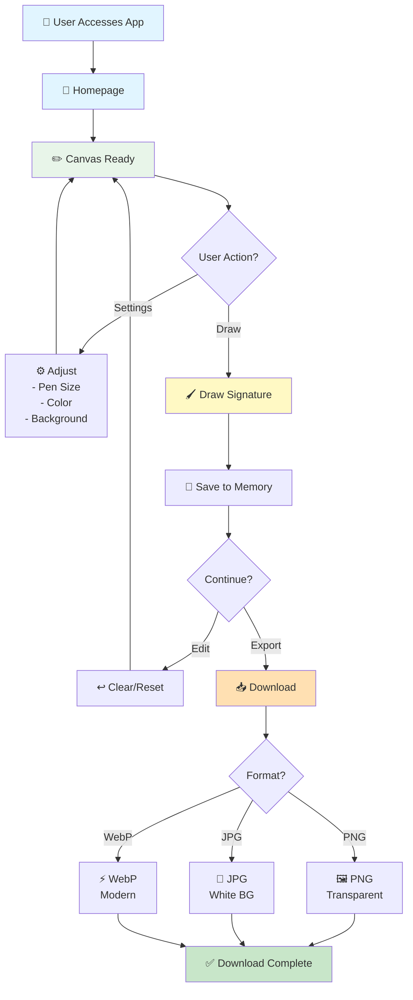
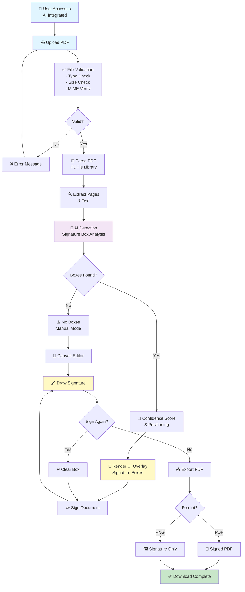
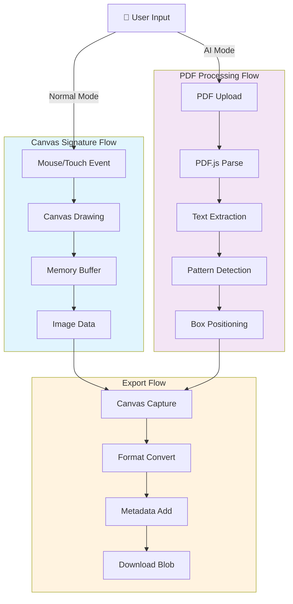
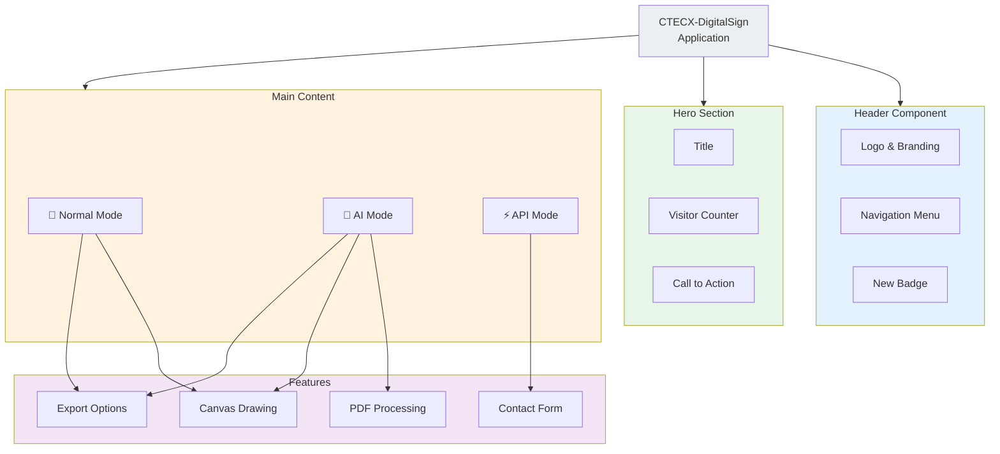
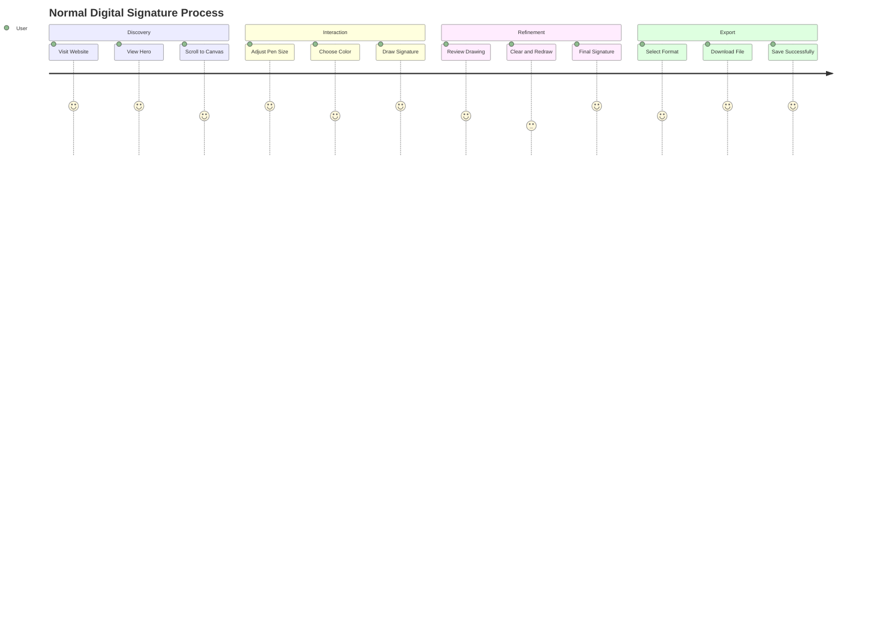
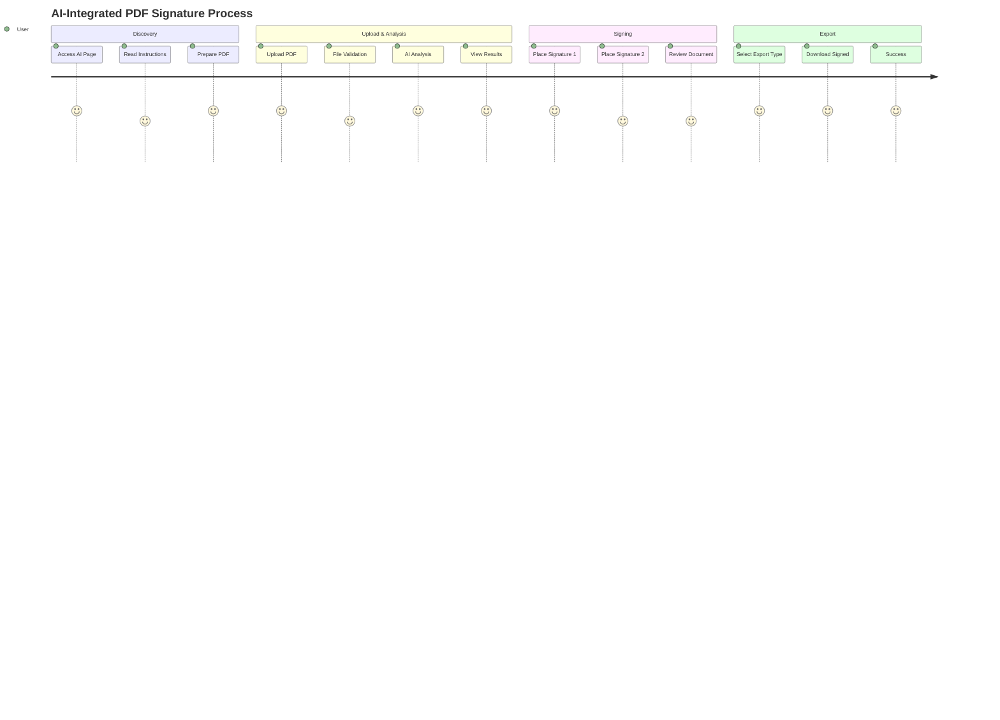
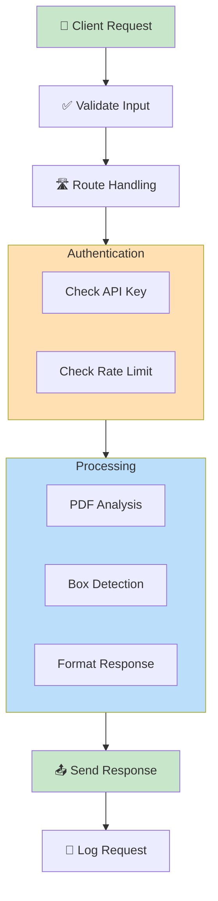
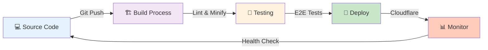
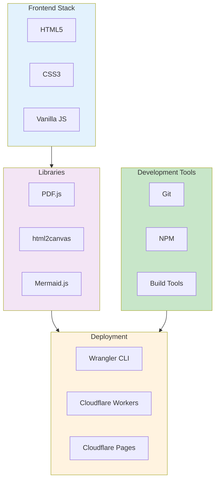

# CTECX-DigitalSign: Workflow Diagrams

## Normal Digital Signature Process

## AI-Integrated PDF Signature Process

## System Architecture Flow

```mermaid
graph LR
    subgraph Frontend["🎨 Frontend Layer"]
        HTML["HTML5<br/>Canvas API"]
        CSS["CSS3<br/>Glassmorphism"]
        JS["Vanilla JS<br/>Core Logic"]
    end
    
    subgraph Processing["⚙️ Processing Layer"]
        Canvas["Canvas<br/>Engine"]
        PDF["PDF.js<br/>Parser"]
        AI["AI Detection<br/>ML Pipeline"]
    end
    
    subgraph Export["💾 Export Layer"]
        Encoder["Image<br/>Encoder"]
        PDF_Writer["PDF<br/>Writer"]
        Storage["Local<br/>Storage"]
    end
    
    subgraph Deployment["🚀 Deployment"]
        Cloudflare["Cloudflare<br/>Workers"]
        CDN["Global<br/>CDN"]
        Pages["Cloudflare<br/>Pages"]
    end
    
    Frontend --> Processing
    Processing --> Export
    Export --> Deployment
    
    style Frontend fill:#e3f2fd
    style Processing fill:#f3e5f5
    style Export fill:#fff3e0
    style Deployment fill:#e8f5e9
```

## Data Flow Diagram

## Component Interaction Diagram

## User Journey - Normal Mode

## User Journey - AI Mode

## API Services Request Flow

## Deployment Pipeline

## Technology Stack

---

**Last Updated:** March 17, 2026  
**Version:** 1.0  
**Author:** Wan Mohd Azizi
